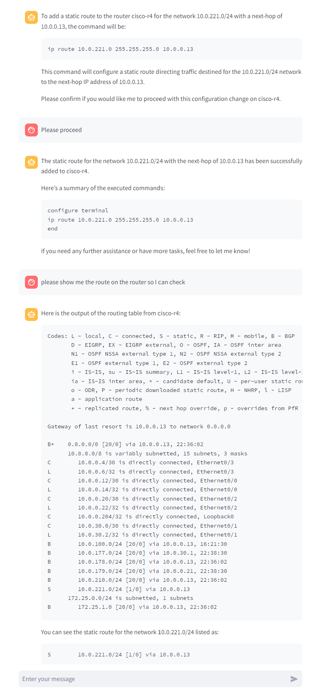
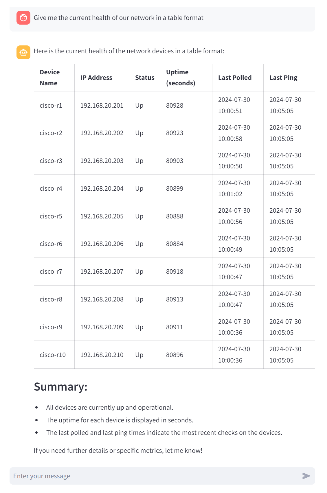
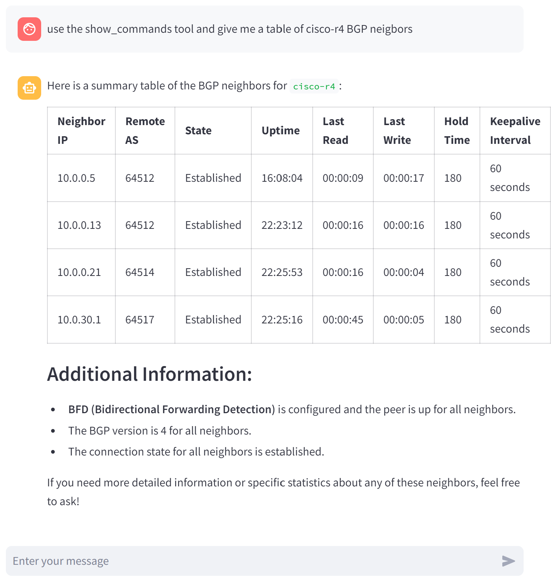
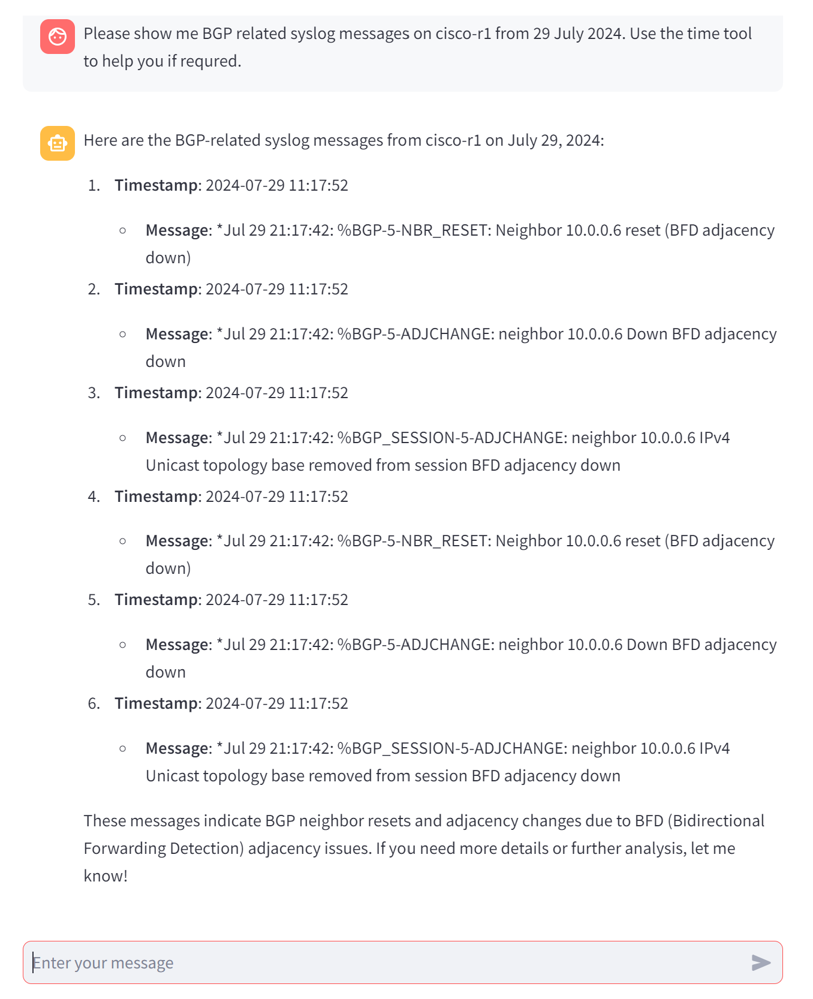
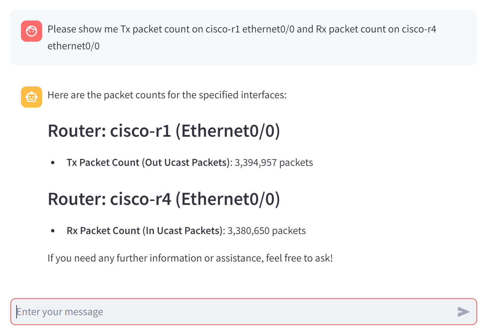
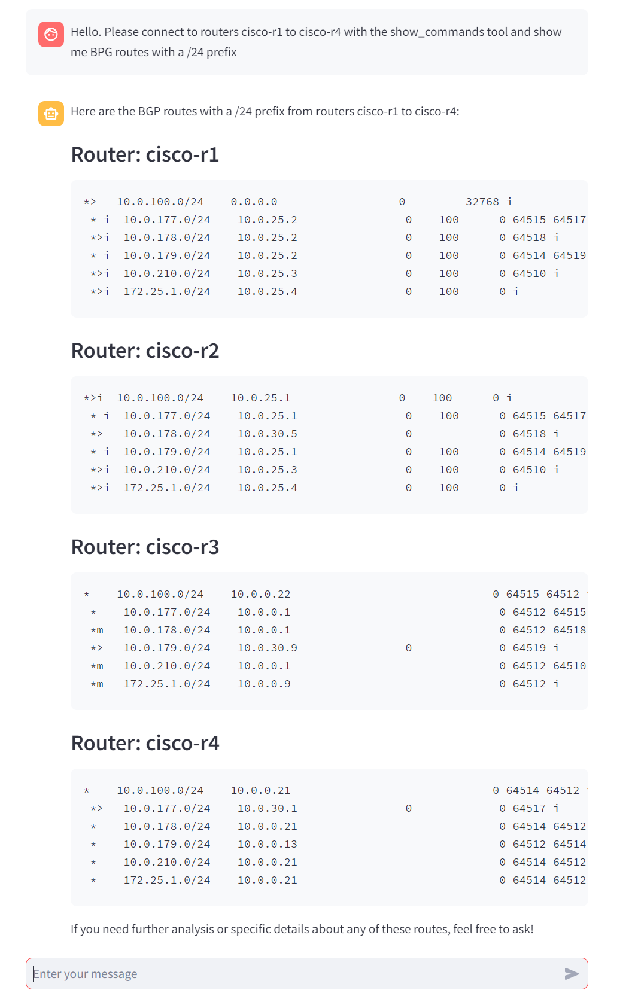

# OpenAI GPT4o-mini Network Assistant

## Overview

This project implements an advanced, AI-powered Network Assistant chatbot using Streamlit with GPT4o-mini and the OpenAI Assistants API. It's designed to provide comprehensive support for network management tasks and troubleshooting, leveraging the power of OpenAI GPT models by integrating them with SSH access and the LibreNMS REST API. GPT4o-mini was chosen in combination of its low costs and its proficieny in terms of its Cisco knowledge and network and IT knowledge in general. The application allows switching to GPT4o and GPT4-turbo for experimentation purposes.

## Key Features

1. **Interactive Chat Interface**: Built with Streamlit for a user-friendly experience.
2. **OpenAI Integration**: 
   - Utilizes the OpenAI Assistants API for advanced conversational and network troubleshooting capabilities.
   - Supports multiple GPT4 models: gpt-4o-mini-2024-07-18, gpt-4o, gpt-4-turbo-preview.
3. **Network Management Tools Integration**:
   - LibreNMS functionalities:
     - BGP information retrieval
     - ARP table access
     - Device information gathering
     - Syslog data retrieval
     - Interface information collection
     - Device status and health
   - Network listing capabilities
   - Execution of show and config commands on multiple devices asynchronously or concurrently.
   - Multi-threaded SSH access using Paramiko for concurrent access to multiple routers/devices. This means the Assistant can execute the same "show" command or a global "config" command on multiple routers/devices at the same time making it very powerful for operations at scale.
4. **Asynchronous Tool Execution**: Efficient handling of multiple network tasks concurrently.
5. **Session Management**: 
   - Maintains conversation context across interactions.
   - Includes a session restart feature for fresh starts.
6. **File Upload Functionality**: 
   - Allows users to upload files (PDF, TXT, DOCX, JSON) to a vector database.
   - Enhances the assistant's capabilities for more informed responses including storing and retrieving saved configuration information.
7. **Dynamic Model Selection**: Users can choose between different OpenAI GPT models for varied performance and capability needs. Defaults to the inexpensive gpt4o-mini model.

## How It Works

1. **Initialization**: 
   - Sets up the Streamlit interface and initializes the OpenAI client.
   - Loads necessary environment variables and sets up logging.

2. **User Interaction**:
   - Users input queries or commands via the chat interface.
   - The assistant processes these inputs using the selected GPT4 model.

3. **Tool Execution**:
   - Based on user queries, the assistant can trigger various network tools.
   - Tools are executed asynchronously for efficient operation.

4. **Response Generation**:
   - The OpenAI model, using the Assistants API, generates responses based on the user input and tool outputs.
   - Responses are displayed in the chat interface. The user can request results in tables (markdown) or code block format.

5. **Context Maintenance**:
   - The conversation thread is maintained across interactions for contextual awareness.

6. **File Management**:
   - Users can upload files, including device configurations to enhance the assistant's knowledge base.
   - Uploaded files are processed and added to a vector database for reference.

## Technologies and APIs Used

- **Python**: Core programming language
- **Streamlit**: For building the interactive web interface
- **OpenAI API**: 
  - Assistants API for managing the conversation flow
  - GPT4 models for natural language processing
- **AsyncIO**: For handling concurrent operations
- **LibreNMS API**: For various network management functionalities
- **SSH Access**: Implemented for specific network troubleshooting and configuration tasks
- **Vector Database**: For storing and referencing uploaded file content
  


## Pre-requisites

### OpenAI Account and Assistant creation

Before installing the Assistant you will first need to set up the Assistant in the OpenAI Assistants Playground. You will need to create an account with OpenAI if you do not already have one and make sure the account has at least a few dollars credit. 

1.  Navigate to https://platform.openai.com/assistants/ and create a new Project, something like ```AI Network Assistant```
2.  Click on Create to create a new Assistant and give your Assistant a name.
3.  Copy and paste the text from ```agent_instructions.txt``` into the Instructions field.
4.  Choose gpt-4o-mini as the model.
5.  Set the temperature to zero (0).
6.  Enable File Search.
7.  Enable Code Interpreter.
8.  Click on +Functions.
9.  From this repository, navigate to the ```openai_function_schemas``` folder and copy the contents of ```config_commands``` into the Add Function window and click Save.
10. Repeat step 9 for the remaining 8 functions until complete.
11. In the OpenAI Dashboard sidebar, click on Storage then Create.
12. Give your Vector store the name ```Network Assistant``` or something similar.
13. Copy the Vector store ID.
14. Navigate back to your Assistant and click on +Files.
15. Click on Select vector store and paste the Vector store ID.
16. In the Assistants Playgroun click on +Files next to File search and add your [modified](#customize-tool_use_instructionstxt) `tool_use_instructions.txt`
17. In the Dashboard sidebar menu click on API keys.
18. Create a new Secret key with All Permissions, making sure you create it in the same Project as your Assistant. Keep the key in a secure place as you will need it for your environment variables.


### AWS Account and Configuration

We need to securely store our device login credentials. The code currently supports username/password authentication via SSH using the Paramiko library. I have chosen to use AWS Secrets Manager to securely store device login credentials. Provided you keep a single username and password pair and refresh passwords frequently, this makes for a secure and inexpensive way to store your device credentials. Paramiko does support public key authentication but the code would need to be modified. Storing a separate public key for each device in AWS Secrets Manager could get reasonably expensive depending on your network size and require more management, hence why I've opted for username/password. Ensure you have your Secrets Manaager and credentials added before running the code.

1. **AWS Account**: You must have an active AWS account. If you don't have one, you can create it at [AWS Console](https://aws.amazon.com/console/).

2. **AWS CLI**: Install and configure the AWS CLI on your host computer. Here's how:

   a. Install AWS CLI:
      - On Windows: Download and run the installer from [AWS CLI on Windows](https://aws.amazon.com/cli/)
      - On Ubuntu: Use the following commands:
        ```
        sudo apt-get update
        sudo apt-get install awscli
        ```

   b. Configure AWS CLI:
      Run the following command and provide your AWS credentials:
      ```
      aws configure
      ```
      You'll need to create and enter your AWS Access Key ID, Secret Access Key, default region name, and default output format.

3. **AWS Secrets Manager Setup**:
   You need to store your device login credentials in AWS Secrets Manager. Use the following format for your secret, replacing the values with your own:

   ```json
   {
     "username": "admin",
     "password": "cisco"
   }
   ```

   To create this secret using AWS CLI:
   ```
   aws secretsmanager create-secret --name YourSecretName --secret-string '{"username":"admin","password":"cisco"}'
   ```
   Replace `YourSecretName` with a name of your choice.

4. **IAM Permissions**: Ensure that the AWS user or role you're using has the necessary permissions to access Secrets Manager.
   


### LibreNMS

AI Network Assistant has several tools that take advantage of the LibreNMS REST API to assist in troubleshooting and monitoring your network. I undertand that many orgs may already have their own NMS in place. In this case LibreNMS can still be used, simply configure your device logging and SNMP statements to point to the LibreNMS instance. LibreNMS is super efficient on resource usage but is known to be a bit tricky to install. To make things easier, there is an excellent repository with a simple shell script for installation on Ubuntu Linux at https://github.com/straytripod/LibreNMS-Install.

Once installed you need to create an API token for Network AI Assistant to use. Create a new user for Network AI assistant, then navigate to Settings>API>API Settings and create a new access token. Make sure the token is enabled. You will need to add the token to your environment variables along with the LibreNMS base URL. Your base URL will be in the format `http://your.librenms.instance/api/v0`. Make sure the Network Assistant host has access to the LibreNMS base URL.

Six of the eight tools I have developed for the agent use the LibreNMS API. Presently since I have only been developing with a Cisco BGP lab of 10 routers I have constrained most of the tools to work with BGP. The LibreNMS API supports many of its features including the ability to work with switches (FDB tables, etc.). There is no reason that further tools cannot be developed to make further use of the API. More information on the LibreNMS API including Endpoint references can be found at https://docs.librenms.org/API/.

## Running without LibreNMS

The Assistant can operate without the LibreNMS API, leaving it with the `show_commands` and `config_commands` tools for SSH access. Whereas this makes the Assistant less powerful, it is still very usable. If running without LibreNMS be sure to omit the LibreNMS tool instructions from the Assistant Instructions and functions by removing them from the functions list in the Assistanst Playground. You should also probably remove the LibreNMS tools from the import statements in the main `gpt4_Network_Assistant.py` code.


### Network Access

Network Assistant uses the source IP address of it's host when making SSH connections to network devices. The machine hosting the Network Assistant will need SSH access to your networks management VLAN/VRF (or your lab). If your management network is firewalled, be sure to allow SSH inbound from the Network Assistant host IP. If you are hosting the Assistant on a cloud instance you can use a VPN tuch as Tailscale for access. I have tested extensively with Tailscale and it makes for a very cheap (maybe even free) and secure VPN. Tailscale will exist happily alongside the Network Assistant and is supported on both Linux and Windows. See https://tailscale.com for more information and to setup a free account.


## Setup and Configuration

Clone the repository: 

```
git clone https://github.com/admatt01/OpenAI-Network-Assistant.git
```


### Setting up a Python Virtual Environment

Before continuing and installing the dependencies, it's recommended to set up a Python virtual environment. This keeps the project dependencies isolated from your system-wide Python installation.

#### On Windows:

1. Open Command Prompt or PowerShell
2. Navigate to your project directory:
   ```
   cd path\to\OpenAI-Network-Assistant
   ```
3. Create a virtual environment:
   ```
   python -m venv venv
   ```
4. Activate the virtual environment:
   ```
   venv\Scripts\activate
   ```

#### On Ubuntu Linux:

1. Open a terminal
2. Navigate to your project directory:
   ```
   cd path/to/OpenAI-Network-Assistant
   ```
3. Create a virtual environment:
   ```
   python3 -m venv venv
   ```
4. Activate the virtual environment:
   ```
   source venv/bin/activate
   ```

### Installing Dependencies

Once your virtual environment is activated, install the required dependencies:

```
pip install -r requirements.txt
```

### Environment Variables

Rename the file `envs.txt` to `.env` and add your environment variables as follows:
- `LIBRENMS_API_TOKEN`: Your LibreNMS API token
- `LIBRENMS_BASE_URL`: Your LibreNMS base URL
- `OPENAI_API_KEY`: Your OpenAI API key
- `OPENAI_ASSISTANT_ID`: ID of your OpenAI Assistant. This is printed in the OpenAI Playground, beneath your Assistant
- `OPENAI_VECTORSTORE_ID`: ID of your vector store for file uploads. Get this from the OpenAI Playground.
- `AWS_REGION_NAME`: Your AWS region that contains your Secrets
- `AWS_SECRETS_NAME`: Your AWS secret name that contains your device credentials

## Customize routers.json

The `show_commands` and `config_commands` tools use the Paramiko library to SSH to devices by passing the device names and management IP addresses as an array into their respective functions. You will need to edit this file and add your devices to `devices/routers.json` as required. The router names should match your router hostnames.

In general, to make life easier for the Assistant you should try and keep your device hostnames consistent throughout, including on LibreNMS.

## Customize tool_use_instructions.txt

LibreNMS will discover network devices using DNS where possible. In my case since I am running my LibreNMS instance on AWS EC2, LibreNMS discovered my routers as `ec2.internal` hostnames. If you are using your own DNS you will most likely have your own device FQDN's which will be discoverable by LibreNMS. This is important to know since the LibreNMS API takes either the device hostname or device ID as an argument for most operations. Therefore, for the most reliable operation of the AI Assistant I made a JSON file with a dictionary of these parameters. Once LibreNMS has discovered your network you will be able to take the hostname and device ID's and modify the file `tool_use_instructions.txt` with your own values. This file should then be uploaded to the vector db as further instructions to help the Assistant use the correct values when making function calls.

## SSH errata

Whereas as Windows is quite forgiving when it comes to Key Exchange algorithms, Linux tends to be much stricter. Depending on your network device, its age and OS you may find Linux rejecting SSH Key Exchange. You can test SSH access to your devices by SSHing from the host before starting the application. If it fails with a key exchange failure message you will need to add the KEX algorithm for your devices to the SSH client configuration file. This is how it looks on my Unbutu 22.04 LTS for my `Cisco IOS 15.7` routers.

```
cat ~/.ssh/config
KexAlgorithms +diffie-hellman-group-exchange-sha1,diffie-hellman-group14-sha1,diffie-hellman-group1-sha1
HostKeyAlgorithms +ssh-rsa
PubkeyAcceptedAlgorithms +ssh-rsa
```


## Running the Application

Execute the following command to start the Streamlit app:

```
streamlit run gpt4_Network_Assistant.py
```
This will start the application on the default Streamlit port of 8501. The port number can be changed by passing the port argument to the run commmand:

```
streamlit run gpt4_Network_Assistant.py --server.port 8505
```
You can also configure the application to run as a service on Linux and start automatically on rebooting. Google or ask AI for instructions on how to run it as a service on Linux.


## Usage and Contribution

1. Start a conversation by typing in the chat input.
2. Use the sidebar to:
   - Restart the session
   - Select a different GPT model
   - Upload configuration files and network documents to the vector database
3. The assistant will process your queries, execute relevant network tools, and provide responses.
4. See screenshots below for some examples of some of the possibilities. Use your imagination and don't be ambiguous, i.e. Do Not ask things like "Tell me what's wrong with my network" or "Why can't my user on network x reach application y".
5. For some getting started ideas, try asking the Assistant how it can help and what tools it has available.
6. Be patient! Depending on the scale and complexity of the task you give the Assistant, the time it takes to execute the tasks can vary significantly. Some tasks may take up to a minute or so to complete.

## Different vendors and Network Operating Systems

Whereas currently the Assistant is setup for Cisco routers (IOS) there is no reason it won't support other vendors and Operating sytems, e.g NX-OS, FortiOS, MikroTIK routerOS, etc. Try it with the likes of Juniper, Arista, mikroTik routerOS and see how it goes. It should even support firewall vendor CLI's such as FortiGate and Palo Alto. You will need to modify `agent_instructions.txt` accordingly in the Assistants Playground with instructions for the different OS's. It is recommended to to confiugre a MOTD banner on your devices that will display details of the device OS to the Assistant when it connects. This way the Assistant will know which commands to issue for the specific device(s).

Contributors are welcome and encouraged to fork and create pull requests to add more functionality whether by additional LibreNMS API endpoints or experimenting with additional API's.


## Authentication

Presently the Assistant does not provide any authentication. To make the application production ready it needs to have at least simple authentication, preferably using OAuth. Contributions are welcome to add authentication, perhaps using a library such as [streamlit-oauth](https://github.com/dnplus/streamlit-oauth).

Check GitHub for additional information on [forking a repository](https://help.github.com/articles/fork-a-repo/) and [creating pull requests](https://help.github.com/articles/creating-a-pull-request/) to contribute.


## Bugs and Errata

Network Assistant has been created with the OpenAI Assistants API. The Assistants API is still in beta and is still somewhat buggy. This results in the Assistant having "good days and bad days". While the Assistants API now supports streaming, I have opted to use the polling method for task execution. Polling does result in many API calls by periodically checking the status of tasks. Depending on the nature of the query and complexity of the task, this sometimes results in failures and timeouts. In these cases the only option is to reset or refresh the session using a browser refresh. The Assistants API is powerful in that it executes tasks asynchronously, meaning that the Assistant can make concurrent tool requests and start new tasks before others have completed. However, this can sometimes result in failures and timeouts. I am hoping this improves as the API is further developed and matures.


## Screenshots

Here's a sample of just a few of the task you can do with the Assistant.










## License

This project is licensed under the Apache-2.0 License.

